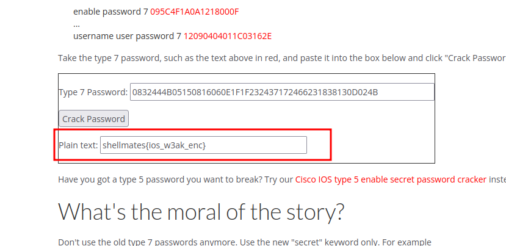

## Description

In a red team engagement, you got access to the network admin's PC. After that you saw this command on the running config of the router `enable password 7 0832444B05150816060E1F1F232437172466231838130D024B`
Can you find the original password?

## Solution

that command looks like a `Cisco` router command, the `enable password 7` command is used to set the password using a reversible, Type 7, password encryption algorithm.

we can decrypt this password [here](https://www.ifm.net.nz/cookbooks/passwordcracker.html) :

- flag: `shellmates{ios_w3ak_enc}`
